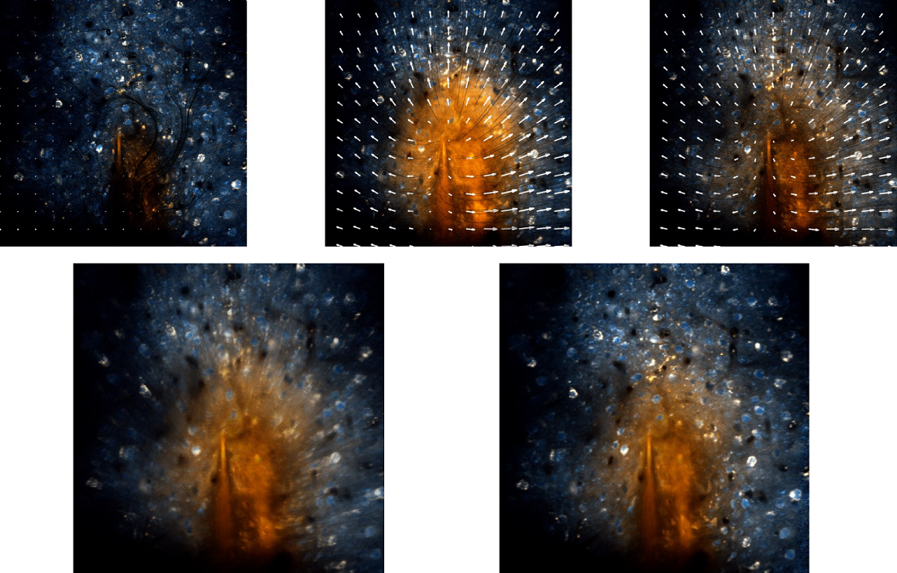

# Flow-Registration: Optical flow based motion compensation / video stabilization / registration for 2-photon imaging data

Toolbox for the compensation and stabilization of multichannel microscopy videos. The code is written in Matlab, Java (IJ Plugin) and C++. The publication for this toolbox can be found [here](https://doi.org/10.1002/jbio.202100330) and the project website with video results [here](https://www.snnu.uni-saarland.de/flow-registration/).




## Requirements

This code requires python 3.10 and cuda 11.8 for the gpu version. 

Initialize the environment with

```bash
conda create --name raft2p python=3.10
conda activate raft2p
pip install torch torchvision torchaudio --index-url https://download.pytorch.org/whl/cu118
pip install -r requirements.txt
```

## Installation via pip and conda

```bash
conda create --name pyflowreg python=3.10
pip install pyflowreg
```

## Getting started

This repository contains the demo scripts ```demos/jupiter.m``` and ```demos/jupiter_minimal_example.m``` which run out of the box and compensate the jitter in an amateur recording of a meteor impact on jupiter. The folder ```demos/examples``` contains examples that illustrate use cases of the toolbox and ```demos/reproduce_journal_results``` contains scripts that replicate the evaluations from our paper.

The plugin supports most of the commonly used file types such as HDF5, tiff stacks and matlab mat files. To run the motion compensation, the options need to be defined into a ```OF_options``` object such as


## Dataset

The dataset which we used for our evaluations is available as [2-Photon Movies with Motion Artifacts](https://www.datadryad.org).

## Citation

Details on the method and video results can be found [here](https://www.snnu.uni-saarland.de/flow-registration/).

If you use parts of this code or the plugin for your work, please cite

> P. Flotho, S. Nomura, D. J. Strauss and B. Kuhn, “Pyflowreg: A python package for high accuracy motion correction of 2P microscopy videos,” arxiv, 2024. [doi:https://]()

BibTeX entry
```
@article{flotea2024c,
    author = {Flotho, P. and Nomura, S. and Strauss, D. J. and Kuhn, B.},
    title = {Software for Non-Parametric Image Registration of 2-Photon Imaging Data},
    year = {2022},
  journal = {J Biophotonics},
  doi = {https://doi.org/}
}
```

and with the Flow-Registration model additionally

> P. Flotho, S. Nomura, B. Kuhn and D. J. Strauss, “Software for Non-Parametric Image Registration of 2-Photon Imaging Data,” J Biophotonics, 2022. [doi:https://doi.org/10.1002/jbio.202100330](https://doi.org/10.1002/jbio.202100330)

BibTeX entry
```
@article{flotea2022a,
    author = {Flotho, P. and Nomura, S. and Kuhn, B. and Strauss, D. J.},
    title = {Software for Non-Parametric Image Registration of 2-Photon Imaging Data},
    year = {2022},
  journal = {J Biophotonics},
  doi = {https://doi.org/10.1002/jbio.202100330}
}
```

